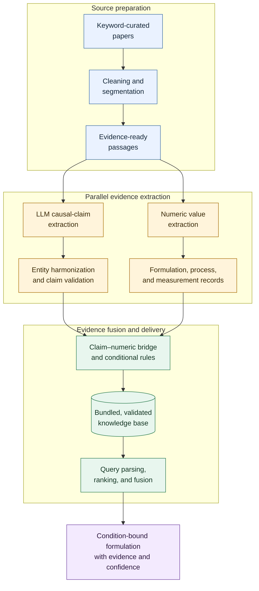

# Full-Text Parallel Evidence Extraction Strategy

## Why this strategy exists

Keyword search, lexical named-entity recognition, and cue matching are useful
for finding candidate evidence. They are not sufficient for building a master
literature knowledge base because they cannot reliably recover scientific
argument roles, mechanisms, experimental context, ontology-quality entities,
or structured numeric observations.

The extraction strategy therefore follows this workflow:

```text
paper reading
  -> batch-local parallel evidence extraction
       -> qualitative claim extraction
       -> numeric data extraction
  -> independent checking and adjudication
  -> correction
  -> deterministic normalization and validation
  -> master admission
  -> periodic entity and ontology harmonization
```

The broader context is shown below. The scope of this document is the
**parallel evidence extraction** stage and the checks required before extracted
records enter the master knowledge base.



## Corpus

For each corpus, record:

- source directory or repository;
- total number of records;
- number of eligible full texts;
- eligibility and exclusion criteria;
- excluded record identifiers and reasons;
- review, chapter, conference, or other non-primary research records.

Eligibility decisions must be recorded before extraction. Excluded records
remain available for audit but do not enter the extraction batches.

## Reader role

The reader works paper by paper and uses scientific judgment rather than
lexical cue matching. For every admitted claim, the reader must:

- read the relevant Results and Discussion together with the necessary
  formulation and method context;
- write a concise expert paraphrase;
- preserve an exact entailing source quote and location;
- identify the comparator or control and evidence type;
- distinguish direct experimental evidence, measurement-supported inference,
  author interpretation, review synthesis, method claims, and correlations;
- extract linked mechanistic chains as multiple triples;
- keep sample labels and exact treatment levels in context fields;
- record relevant system, formulation, process, and measurement conditions;
- avoid upgrading review statements or uncontrolled associations to causal
  facts.

## Numeric extractor role

The numeric extractor works from the same evidence-ready passages in parallel
with the claim reader. It extracts source-stated:

- formulation and composition values;
- process parameters;
- experimental and environmental conditions;
- sample and treatment levels;
- measured responses, uncertainty, replicate counts, and statistical markers;
- measurement methods and units.

For every admitted numeric record, the extractor must:

- preserve the raw value, raw unit, basis or denominator, and source location;
- link the value to the correct paper, experiment, sample, treatment, and
  variable;
- distinguish reported measurements from author-calculated values, values
  estimated from graphs, and extraction-system-derived values;
- retain ranges, thresholds, detection limits, and missing values as reported;
- flag ambiguous headers, units, denominators, table structure, or sample
  mappings;
- avoid performing calculations, unit conversion, or unsupported inference
  during extraction.

Claims and numeric records remain separate outputs. They are linked later
through shared paper, passage, experiment, sample, treatment, comparator, and
condition identifiers.

## Checker role

The checker reviews batch-local outputs and assigns:

```text
KEEP
KEEP_WITH_CONTEXT
MERGE_WITH_EXISTING
GENERALIZE_AND_KEEP
REVISE
DROP
NEEDS_SOURCE_CHECK
```

For claims, the checker verifies source entailment, causal direction, negation,
epistemic status, reusable entities, controlled predicates, conditions,
comparators, foreign keys, and whether method or review material belongs
outside the causal graph.

For numeric records, the checker verifies transcription, sample and treatment
mapping, variable identity, unit, basis, uncertainty, replicate count,
measurement method, source location, and whether any value has been inferred
or transformed.

Only corrected, checker-approved records proceed to deterministic validation.

## Controlled predicates

Use a project-defined controlled vocabulary. A general starting set is:

```text
promotes
inhibits
increases
decreases
stabilizes
destabilizes
strengthens
weakens
disrupts
enables
limits
optimizes
converts_to
shifts_to
has_no_detectable_effect_on
has_non_monotonic_effect_on
correlates_with
is_measured_by
is_indicated_by
occurs_during
adsorbs_at
forms
```

Avoid vague predicates such as `affects`, `changes`, `modulates`, `improves`,
and `enhances`.

## Domain representation

Represent independent scientific descriptors as orthogonal facets rather than
forcing them into one flat taxonomy. Depending on the domain, facets may
describe:

- composition or material identity;
- structure or topology;
- formation or stabilization mechanism;
- size or scale;
- loading or concentration regime;
- physical state;
- process history;
- measurement or assay context.

Composite systems may inherit several facets. The original source wording must
be preserved alongside normalized facet assignments.

## Numeric observations

Numeric values are formulation-, process-, experiment-, or sample-specific
observations. Store:

- the raw expression;
- normalized value, when deterministic normalization is possible;
- raw and normalized units;
- basis, numerator, and denominator where relevant;
- uncertainty and replicate count;
- sample, treatment, comparator, and condition identifiers;
- source span and location;
- whether the value is reported, author-derived, graph-estimated, or
  system-derived.

Normalize only explicit or unambiguous quantities. Do not reinterpret unrelated
percentages, yields, purities, recoveries, stock-solution concentrations, or
surface measures as formulation fractions.

## Claim–numeric bridge

Claims and numeric records are connected only after independent checking. A
bridge may indicate:

```text
DIRECT_SUPPORT
PARTIAL_SUPPORT
CONTEXT_ONLY
CONTRADICTS
SAME_EXPERIMENT
AUTHOR_DERIVED
UNRESOLVED
```

A numeric difference does not by itself establish a causal relation.
`DIRECT_SUPPORT` requires compatible experimental design, comparator,
conditions, source language, and measurements.

## Batch manifest

Each batch manifest records:

- included paper identifiers;
- input file hashes;
- parser and segmentation versions;
- schema and prompt versions;
- extractor and checker identifiers or versions;
- normalization and validation code versions;
- extraction status and row counts;
- known parsing or source issues;
- timestamps and correction history.

## Batch-local outputs

Each `batches/Bxx/` folder must contain paired CSV/JSON files:

```text
papers
passages
claims
triples
entities
numeric_records
formulation_records
process_records
measurement_records
claim_numeric_bridges
method_notes
excluded_records
batch_manifest.json
extraction_report.md
checker_report.md
validation_report.md
```

Only checker-approved and deterministically valid rows enter `master/`. Raw,
corrected, normalized, excluded, and admitted records must remain distinguishable
so that every master record can be traced back to its source and extraction
history.
