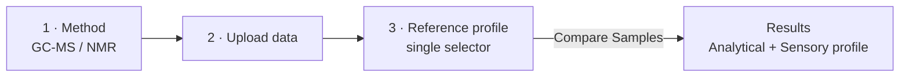

_Last updated: 2026-08-31 · Software architect (UI/UX) · design spec — Analytics as a 4th toggleable module + simplified workflow (Confirm-format removed, single reference + Compare Samples)_

# Analytics Module — Design Specification

**Scope.** Register **Analytics** as a fourth, user-toggleable module beside Oracle · Research · Simulate, and simplify its guided workflow. Oracle / Research / Simulate are **not** modified. Grounded in the platform's existing feature-flag registry and the workspace at `app/dev/analytics_workspace.html`.

## 1. Module registration

Analytics is an **optional module** via the existing flag registry (`Release Center/features.json`) — the same switch every toggleable surface uses, so enabling/disabling it can't affect other modules. The `dev`/`prod` booleans **are** the on/off control (flipped in the Release Center per environment).

```json
"analytics_module": {
  "label": "Analytics module",
  "description": "Bring-your-own GC-MS/NMR data -> compare to a reference profile -> full analytical + sensory profile.",
  "kind": "screen",
  "status": "preview",
  "where": { "screen": "Top nav (4th module)", "spot": "Top bar, right of Simulate", "file": "app/meatcode_mockup.html" },
  "destination": "Top-nav module alongside Oracle / Research / Simulate",
  "url": "/app/dev/analytics_workspace.html",
  "dev": true,
  "prod": false
}
```

The app turns an ON flag into `body.ff-analytics_module`. The load-time nav pass (which already builds the top bar) **appends one chip, gated on the flag** — the Oracle/Research/Simulate list is untouched:

```js
// after the existing top-nav is assembled, additive only:
if (document.body.classList.contains('ff-analytics_module')) {
  addDomainChip({ id: 'analytics', label: 'Analytics', target: '#analytics-workspace' });
}
```

OFF ⇒ no chip, no route, zero effect on other modules.

## 2. Updated workflow

The old flow was **Method → Upload → Confirm format → Reference**. Remove §3; Upload advances straight to a single-reference step whose action is **Compare Samples**.



## 3. "Compare Samples" navigation logic (pseudo-code)

```
on click "Compare Samples":
    ref = referenceSelector.value          // exactly one profile
    if (!ref) { hint("Choose a reference profile"); return }
    state.reference = ref
    goToResults()

function goToResults():
    hideAllWorkflowPanels()
    show(ResultsPanel)
    renderAnalyticalProfile(state.tool, state.reference)   // chromatogram/spectrum + peak stats
    renderSensoryProfile(state.reference)                  // 8-axis radar
    // "Compare with your own data" affordance remains available on Results
```

This reuses the workspace's existing `goStep()` / `renderResults()` — the Compare Samples button simply routes from Reference to the Results panel (no intermediate Confirm-format step).

## 4. Configuration changes

| Change | File | Detail |
|---|---|---|
| Register module flag | `Release Center/features.json` | Add `analytics_module` (dev ON / prod OFF). |
| Add nav chip | `app/meatcode_mockup.html` | Flag-gated append only; existing list unchanged. |
| Remove Confirm-format | `app/dev/analytics_workspace.html` | Delete that panel + its sidebar step; renumber → Method 1 · Upload 2 · Reference 3 · Results. |
| Upload → Reference | same | Upload's "Continue" now targets the Reference step. |
| Single reference | same | One single-select control + "Compare Samples"; no multi-select, no parallel controls. |

## 5. Constraints honored

- **Oracle / Research / Simulate unchanged** — only an additive, flag-gated chip.
- **Confirm-format removed** from the workflow.
- **Single reference profile only** — one selector, single selection.
- **User-toggleable** — the `analytics_module` flag turns the whole module on/off with no side-effects on other modules.

## Open item (needs your call)

"Single selectable reference profile" is read as **one selector with a single choice** (default auto-matched to the sample; user may change it). If you instead mean a **fixed** profile with no choice at all, that's a one-line change — say which.

## Next (implementation, on approval)

Flag-first per platform convention: apply the four config changes above on the **dev** branch, verify on staging (`deploy-dev`), then flip `prod` / `promote-to-prod` to graduate. No production or other-module impact until you toggle it.
